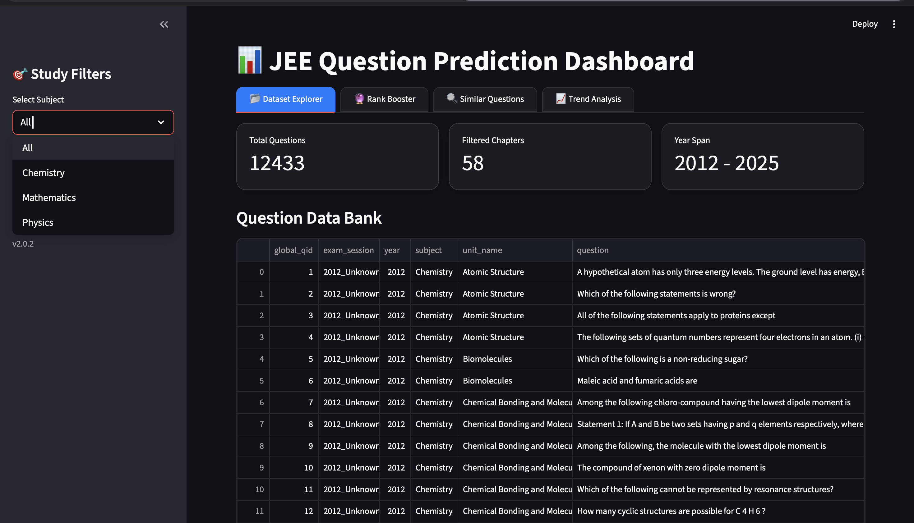
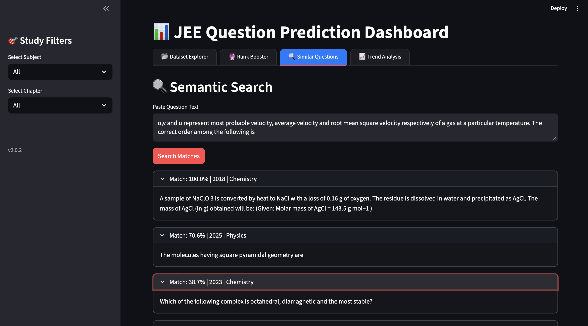
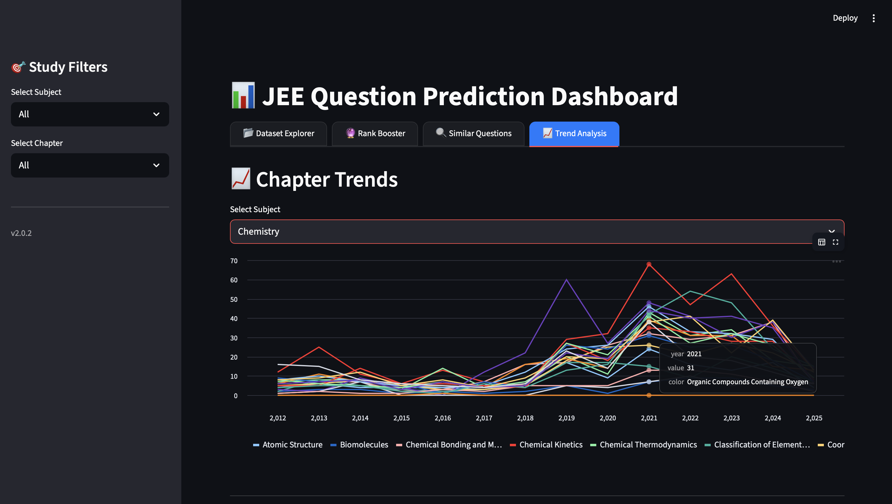
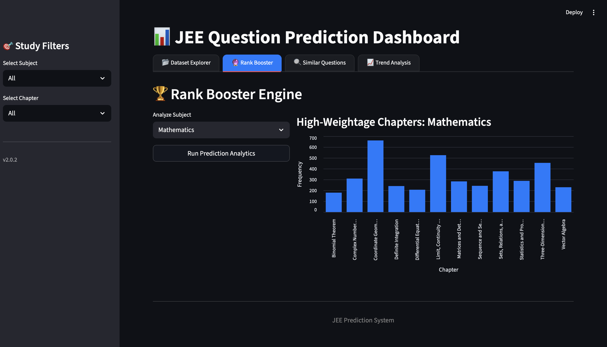

# 🚀 JEE Rank Booster & Question Prediction System

An AI-powered analytics platform for **JEE Main preparation**, providing **question prediction**, **trend analysis**, **PYQ similarity search**, and **rank boosting insights** using machine learning and data analytics.

The system analyzes Previous Year Questions (PYQs) to help students prioritize high-impact chapters and improve exam performance.

---

## 📌 Features

### 📊 Dashboard Analytics
- View predicted and historical JEE questions
- Filter by subject and chapters
- Download filtered datasets

### 🔍 Similar Question Finder
- Enter any question
- Get most similar PYQs
- Shows year and similarity score

### 📈 Chapter Trend Analysis
- Year-wise chapter appearance trends
- Identify rising or declining topics
- Interactive trend visualization

### 📚 Question Distribution
- Year-wise subject distribution
- Chapter-level question counts
- Multi-year analysis

### 🔮 Next Paper Prediction
- Predict chapter distribution for upcoming papers
- Uses recency weighting & paper frequency

### 🏆 Rank Booster Engine
- Identifies **high ROI chapters**
- Difficulty-aware scoring
- Highlights easiest scoring topics

---

## 🧠 Technologies Used

- Python
- Streamlit
- Pandas
- Scikit-learn
- TF-IDF Vectorization
- Cosine Similarity
- Joblib

---

## 📂 Project Structure

```

question_prediction/
│
├── streamlit_app.py          # Main dashboard UI
├── Rank_Booster.py           # Rank booster logic
├── build_recommender.py      # Recommender builder
├── output/
│   └── finalDataSheet/
│       └── predicted_questions.csv
│
├── webapp/                   # Flask web interface (optional)
├── scripts/
├── models/
├── requirements.txt
└── README.md

````

---

## ⚙️ Installation

### 1️⃣ Clone repository
```bash
git clone https://github.com/your-username/jee-rank-booster.git
cd jee-rank-booster
````

### 2️⃣ Create virtual environment

```bash
python -m venv venv
source venv/bin/activate   # Mac/Linux
venv\Scripts\activate      # Windows
```

### 3️⃣ Install dependencies

```bash
pip install -r requirements.txt
```

---

## ▶️ Run Application

```bash
streamlit run streamlit_app.py
```

App opens in browser automatically.

---

## 📊 Dataset

Dataset contains:

* PYQ questions
* Subject mapping
* Chapter mapping
* Year & session info
* Question metadata

Derived from JEE Main past papers.

---

## 🎯 Use Cases

* JEE aspirants planning revision
* Coaching analytics
* Chapter importance analysis
* Smart test preparation
* PYQ exploration

---

## 🚀 Future Improvements

* Difficulty prediction
* Personalized study planner
* Paper simulator
* Rank prediction model
* Semantic search (BERT)
* Weak topic detection

---

## 🤝 Contributing

Pull requests are welcome. For major changes, please open an issue first.

---

## 📜 License

Open-source for educational purposes.

---

## 👨‍💻 Author

Aaryan Singh
AI & Data Science Enthusiast

---
## 📷 Application Screenshots

### Dashboard


### Similar Question Finder


### Trend Analysis


### Rank Booster

